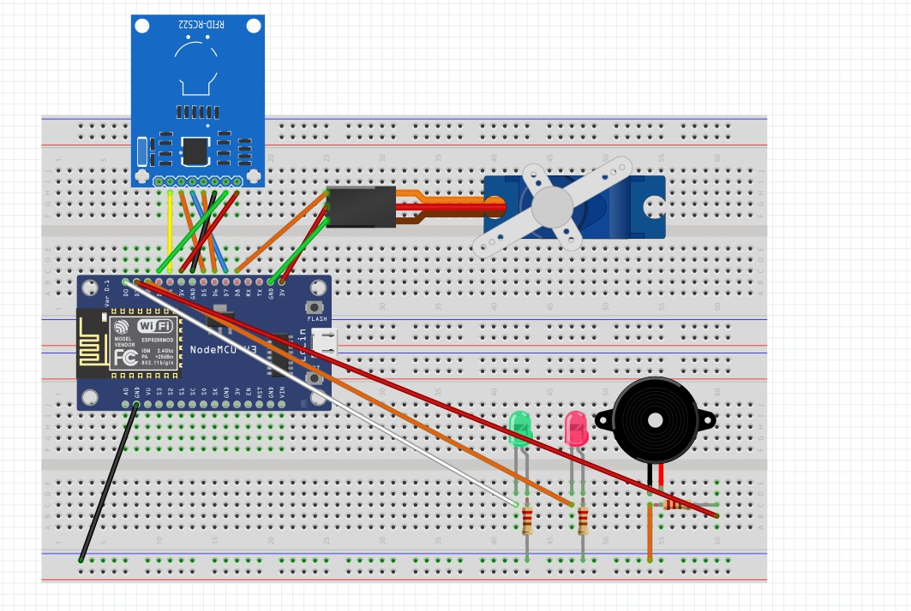

# Barrier

## Overview
This project simulates how a barrier works in real life. The project contains a RFID reader. If the user brings the correct card close to the reader, the servo in the project moves, the green LED lights up, the buzzer makes a sound, and the barrier is raised for 3 seconds. After the seconds pass, the buzzer emits a warning signal that the barrier will close, and then it closes. The red LED is on while the barrier is closed. More than that, an application has been created in which the user can see the number and the time the barrier was raised.

## Schematics

## Pre-requisites
* Arduino Uno board (or any compatible board)
* 2 LEDs, a green and a red one (5 mm)
* 1 buzzer
* 3 resistors (220 Ohms)
* several jumper wires (m to m)
* RFID module with card and tag
* 1 breadboard
* 1 servo
* A-micro USB cable

## Setup and Build

1. Install Arduino IDE: https://www.arduino.cc/en/software . 
2. After the installation is complete, create a new sketch (option available at File section or by pressing Ctrl + N). This step will create a .ino file, where the code will be written. Be aware that some libraries need to be installed. 
3. After the code has been written, connect the board to the laptop using the USB cable. This will cause some lights on the board to blink.
4. Select the board used from the list of boards (Arduino Uno). If the laptop can recognize the board, the connection will also appear under Ports. Select the port and press OK.
5. If everything worked fine up to this point, the connected board should be visible on the bottom-right part of the screen. Otherwise, the board name and the message 'not connected' will be displayed.
6. If the board is successfully connected, run the sketch by pressing the Verify button. If the sketch has compiled with no errors, press the Upload button.
7. Open http://192.168.213.208 to see the application.
### Everything is completed, and it should work now. You can use the barrier!
