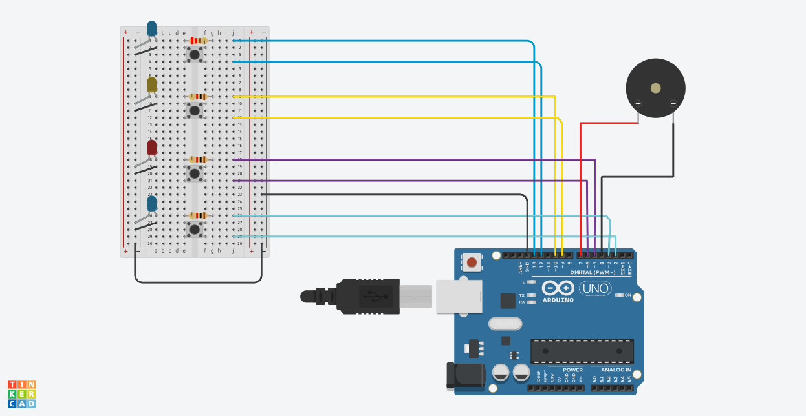

# Led Memory Game

## Overview
This project demonstrates how to create an LED memory game. In this game, there are four LEDs, and the user has to remember the order in which the LEDs turn on. Once the sequence is shown, the user is asked to enter the same order using four push buttons. If they enter the sequence correctly, the game continues and a new LED blinking is added to the sequence. If the user fails, the game restarts with another random sequence. Additionally, there is a buzzer that creates sounds whenever a button is pressed or when the user makes a mistake.

## Schematics

## Pre-requisites
* Arduino Uno board (or any compatible board)
* 4 LEDs (5 mm)
* 1 buzzer
* 4 resistors (220 Ohms)
* 14 jumper wires (m to m)
* 1 breadboard
* 4 push buttons
* A-B USB cable

## Setup and Build

1. Install Arduino IDE: https://www.arduino.cc/en/software . 
2. After the installation is complete, create a new sketch (option available at File section or by pressing Ctrl + N). This step will create a .ino file, where the code will be written.
3. After the code has been written, connect the board to the laptop using the USB cable. This will cause some lights on the board to blink.
4. Select the board used from the list of boards (Arduino Uno). If the laptop can recognize the board, the connection will also appear under Ports. Select the port and press OK.
5. If everything worked fine up to this point, the connected board should be visible on the bottom-right part of the screen. Otherwise, the board name and the message 'not connected' will be displayed.
6. If the board is successfully connected, run the sketch by pressing the Verify button. If the sketch has compiled with no errors, press the Upload button.
### Everything is completed, and it should work now. Have fun playing the game!